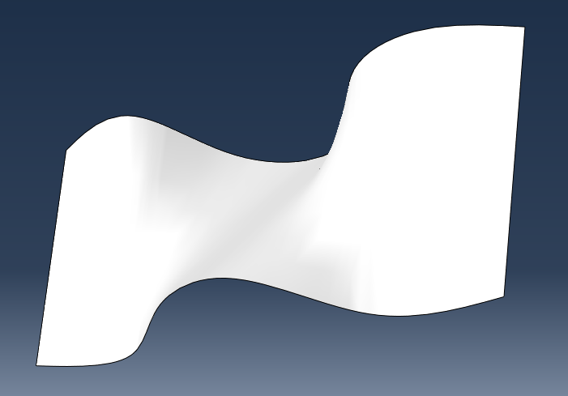

# vkNURBS

**vkNURBS** is an open-source C++ project that provides Vulkan compute shaders that operate on Non-Uniform Rational B-Splines (NURBS).

By moving NURBS processing from the CPU to the GPU, this project provides a high-performance foundation for Computer-Aided Design (CAD), computational geometry, and 3D modeling applications.

## Features

* **GPU-Accelerated Evaluation:** Utilizes Vulkan 1.3 compute shaders to process thousands of independent surface points in parallel.
* **SSBO Data Structures:** Efficiently maps complex mathematical geometry data (control points, weights, knot vectors) into Shader Storage Buffer Objects (SSBOs).
* **Seamless Pipeline Integration:** Demonstrates synchronization between compute and graphics queues, routing the generated vertex data directly into the Vulkan rendering pipeline without CPU round-trips.
* **Cross-Platform:** Built with standard C++ and CMake, supporting Windows and Linux environments.

## Architecture Overview

Evaluating a NURBS surface conventionally requires massive arrays of independent calculations. vkNURBS shifts this workload to the GPU through the following pipeline:

1. **Data Transfer:** The host application defines the NURBS properties (degree, control points, knots) and maps them into Vulkan SSBOs.
2. **Compute Dispatch:** A Vulkan compute shader (`.comp`) is dispatched. Each invocation of the shader calculates the 3D coordinates of a specific parameter `(u, v)` on the NURBS surface.
3. **Geometry Generation:** The compute shader writes the evaluated surface points and corresponding normal vectors into a destination buffer.
4. **Rendering:** The destination buffer is bound as a vertex buffer in the graphics pipeline, and the resulting mesh is rendered to the screen.

## Prerequisites

To build and run vkNURBS, you will need:

* A C++17 (or newer) compatible compiler (MSVC, GCC, or Clang)
* [Vulkan SDK](https://vulkan.lunarg.com/) (Version 1.3 or higher)
* [CMake](https://cmake.org/) (Version 3.15 or higher)